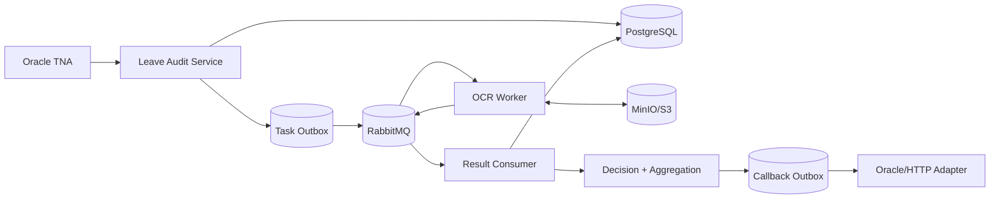
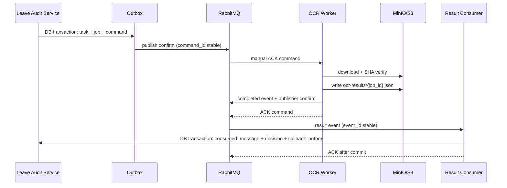

# Leave Audit 异步拆分（RabbitMQ）

## 边界

Leave Audit Service 负责任务、附件元数据、PostgreSQL 状态、规则/版本快照、聚合、人工复核和 Callback Outbox。OCR Worker 只下载对象、校验 SHA、拆页、OCR/VLM/plugin，并把完整结果写回对象存储。





## Contract 与状态

`OcrCommandV1` 只携带 `object_key`、`content_sha256`、`plugin_name`、`pipeline_profile` 和 `ocr_profile_snapshot_id`；二进制、Base64、业务规则和完整 Prompt 不进入 MQ。`OcrResultEventV1` 只携带结果对象 key/hash、页数、引擎版本和安全错误摘要。

任务同时维护：

- OCR：`CREATED → QUEUED → PROCESSING → SUCCEEDED/FAILED/DEAD`
- 决策：`PENDING → ANALYZED → REVIEW_REQUIRED/PASS/REJECT`
- 回写：`NOT_REQUIRED → PENDING → PROCESSING → SUCCEEDED/FAILED/DEAD`

因此 `ocr_status=SUCCEEDED, decision_status=PASS, callback_status=FAILED` 是合法状态。

幂等键为 `(consumer_name,event_id)`；Outbox 重发保留 `command_id`，基础设施重试保留 `job_id`，人工重跑生成新 job/command。Result Consumer 在 DB commit 后才 ACK。Worker 使用 manual ACK，默认 `prefetch=1`，重试为 30s → 5m → 30m → DLQ，禁止永久 `requeue=true`。

## 多附件聚合

默认 `ALL_REQUIRED`，严重度 `PASS < REVIEW < REJECT`；技术 ERROR 不转换为 REJECT。`PASS+PASS=PASS`、`PASS+REVIEW=REVIEW`、`PASS+REJECT=REJECT`、`REVIEW+REJECT=REJECT`、`PASS+ERROR=等待`、`REJECT+ERROR=等待（除非 policy 明确足够）`、`ERROR+ERROR=技术失败`。代码入口为 `aggregate_attachment_decisions`。

## 配置与回写

规则、OCR profile、field mapping、callback policy 使用独立版本 ID，版本状态为 `DRAFT/VALIDATED/APPROVED/PUBLISHED/RETIRED/ROLLED_BACK`。审核事务只写 Callback Outbox；Callback Worker 成功、临时失败重试、达到上限进入 DEAD，不回滚已经完成的 OCR/审核。

## 运行方式

```bash
docker compose -f docker-compose.dev.yml up -d
python -m scripts.migrate_postgres
ID_DOC_OCR_EXECUTION_MODE=sync  id-doc-ocr-api
ID_DOC_OCR_EXECUTION_MODE=shadow id-doc-ocr-api
ID_DOC_OCR_EXECUTION_MODE=async  id-doc-ocr-api
id-doc-ocr-worker
id-doc-ocr-result-worker
id-doc-ocr-callback-worker
```

默认仍是 sync。shadow 会保存新异步命令但不改变同步决策；async 的 `POST /leave-audit/tasks/{id}/run` 返回 HTTP 202 和 job id，使用 `GET /leave-audit/tasks/{id}` 轮询三个正交状态。回滚只需切回 `ID_DOC_OCR_EXECUTION_MODE=sync`，保留已落库任务和 Outbox 供审计。

## 排障

- Outbox 未发布：检查 `outbox_event.published_at`、RabbitMQ publisher confirm 和连接/vhost。
- Worker DLQ：检查 `safe_error_message`、对象 key、SHA 和页数限制。
- 结果未决策：检查 `consumed_message`、结果对象 hash、规则 snapshot 是否存在。
- 回写失败：检查 `callback_outbox` 的 `attempt_count/last_error`；人工修复后重新置为 PENDING。
- 本地对象默认在 `.local/object-storage`；生产必须使用 S3/MinIO 凭据环境变量。
