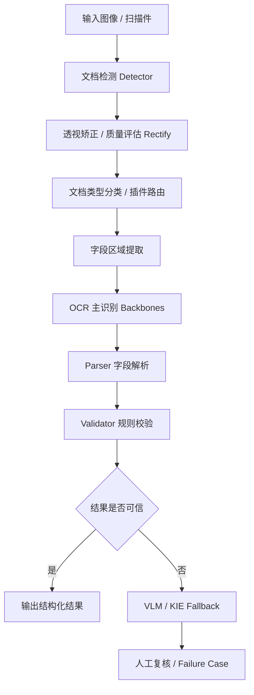

# id-doc-ocr 项目汇报（飞书友好版）

## 汇报摘要

id-doc-ocr 是一个面向证件、票据及结构化文档场景的自托管 OCR 项目。

它的核心目标不是做一个通用 OCR Demo，而是围绕“字段级结构化抽取”打造一条更接近生产系统的识别链路，包括：文档检测、图像矫正、OCR 识别、字段解析、规则校验、VLM 兜底以及人工复核预留能力。

从当前代码和文档来看，这个项目已经具备较完整的平台骨架，适合作为“证件识别平台底座原型”继续演进。

---

## 一、项目定位

**一句话定位：**
一个面向证件/结构化文档的自托管 OCR 平台原型。

**不是：**
- 通用 OCR Demo
- 只关注整页文本识别效果的工具
- 单模型实验代码

**更像：**
- 面向业务字段抽取的识别系统
- 可校验、可审计的识别流水线
- 可扩展、可部署的技术底座

---

## 二、项目目标

从 README 和架构文档看，项目有几个非常明确的目标：

- 提高字段级准确率，而不是只追求整页 OCR 可读性
- 支持结构化输出，适配证件/票据等场景
- 提供可解释、可审计、可回归的识别流程
- 支持本地部署与容器化部署

### 设计原则

1. **确定性优先，生成式补充**
   - 优先模板、字段、规则识别
   - 再用 VLM / KIE 做兜底

2. **字段优先于全文**
   - 更重视姓名、证件号、日期、MRZ 等关键字段的 exact match

3. **校验是核心能力**
   - 没有业务校验的 OCR，不算生产可用

4. **人工复核是系统的一部分**
   - 低置信度和冲突结果需要留出人工介入入口

---

## 三、系统架构

### 架构特点

- 多阶段流水线，而不是单模型一步到位
- 前处理、识别、解析、校验、复核职责清晰
- 模块可替换，便于后续升级模型或扩展文档类型
- 更接近生产系统，而不是实验性脚本

---

## 四、当前已具备的能力

### 1. 插件化文档支持
目前已支持多类文档插件：

- `china_id`
- `passport`
- `boarding_pass`
- `hukou_booklet`
- `train_ticket`
- `medical_record`

每类文档插件可以独立维护：
- parser
- validator
- config
- label spec
- train recipe

### 2. 多后端适配
当前支持的 OCR / VLM 方向包括：

**OCR：**
- mock
- rapidocr
- paddleocr
- got_ocr（预留）

**VLM：**
- mock
- paddleocr_vl

### 3. API 服务
当前对外提供：
- `GET /health`
- `GET /capabilities`
- `POST /infer`

### 4. CLI 工具
支持：
- 列插件
- 校验插件
- 数据集摘要
- manifest 构建 / 切分
- 启动服务

### 5. 容器化与部署
项目已提供：
- Dockerfile
- docker-compose.yml
- Makefile
- .env.example

### 6. 回归与测试
项目已具备：
- parser regression
- asset smoke regression
- 服务接口测试
- JSON 报告输出

---

## 五、技术栈

### 基础框架
- Python 3.10+
- FastAPI
- Uvicorn
- Pydantic 2

### OCR / 多模态能力
- PaddleOCR
- PaddleOCR-VL
- RapidOCR
- GOT-OCR（接口已预留）

### 工程化能力
- pytest
- httpx
- Docker / Docker Compose
- Makefile
- setuptools / pyproject

### 技术选型特点
整体偏务实，重点在于：
- 可运行
- 可替换
- 可测试
- 可部署

---

## 六、项目亮点

### 1. 不是简单 OCR 调包
项目不是“上传图片 → 返回文本”这么简单，而是强调：
- 字段抽取
- 规则校验
- 结构化输出
- 低置信度处理

### 2. 架构路线正确
项目采用的是更适合证件识别场景的路线：
- 确定性优先
- 模型增强兜底
- 校验优先
- 可复核

### 3. 插件化扩展能力强
不同文档类型可以独立维护 parser/validator/config，后续扩展空间大。

### 4. 工程意识较强
相比很多 OCR Demo，这个项目已经具备：
- API
- CLI
- Docker
- healthcheck
- failure case 记录
- regression report

### 5. 回归体系是一个加分项
当前不仅有功能代码，还有质量闭环：
- 样本
- fixture
- 回归报告
- 错误样本沉淀

---

## 七、当前成熟度判断

### 当前阶段判断
**架构和解析层已经比较完整，但底层识别能力仍偏 Demo / 骨架态。**

### 相对成熟的部分
- 项目定位清晰
- 插件化结构完整
- parser / validator 逻辑较扎实
- API / CLI / Docker 已打通
- 回归测试机制较完整
- 文档较齐全

### 尚未完全成熟的部分
- detector / rectify 仍偏 mock
- GOT-OCR 仍是 placeholder
- VLM 路径更像增强项，不是完全稳定主链路
- regression 结果更偏 fixture / public sample
- 生产化监控、告警、审计、复核后台仍需补齐

### 总结判断
这个项目已经不是纯概念验证，但距离真正生产级落地还差关键几步。

---

## 八、当前风险与短板

### 1. 真实复杂场景能力还需验证
真实业务里会遇到：
- 模糊
- 反光
- 遮挡
- 畸变
- 多语言混排
- 多版本模板差异

这些场景的稳定性还需要更多真实样本评估。

### 2. 当前测试结果偏理想化
当前回归结果很漂亮，但更能代表“已建模场景的稳定性”，不能直接等价于真实生产精度。

### 3. 插件扩展带来维护成本
后续每新增一个文档类型，都需要维护：
- parser
- validator
- 样本
- 测试
- 文档

### 4. 多模型路线会引入额外复杂度
包括：
- 环境依赖
- 推理性能
- 稳定性
- 成本
- 可复现性

### 5. 人工复核闭环还未真正产品化
虽然架构预留了 review 思路，但还没有形成完整的业务工作流。

---

## 九、下一步建议

### 1. 强化底层识别能力
优先补 detector / rectify，尤其是拍照场景下的：
- 定位
- 透视矫正
- 质量评分

### 2. 建立更真实的数据与评估体系
扩充：
- 真实拍照样本
- 多模板版本
- 异常样本
- 模糊/反光/遮挡样本

### 3. 完善 failure case 闭环
形成：
- 失败样本自动沉淀
- 错误类型归类
- 回归集反哺
- 模型与规则优化闭环

### 4. 补齐生产化能力
建议补充：
- 日志与监控
- 指标统计
- 告警
- 审计
- 部署规范
- 模型版本管理

### 5. 推进人工复核流程产品化
将 review 从设计概念变成实际工作流，是迈向业务落地的重要一步。

---

## 十、结论

总体来看，id-doc-ocr 是一个方向正确、工程意识较强的项目。

它已经完成了：
- 生产导向的 OCR 平台骨架
- 多文档插件解析能力
- 基础 API / CLI / Docker 服务化能力
- 回归测试与质量闭环基础

它的价值不在于“已经解决所有 OCR 问题”，而在于它已经具备了成为“证件识别平台底座”的条件。

下一阶段的重点，不是继续堆概念，而是补齐：
- 前处理能力
- 真实数据评估
- 人工复核闭环
- 生产化运维能力

如果这些能力逐步补齐，这个项目是有机会演进成真正可落地的证件识别平台的。

---

## 附：适合口头汇报的一段总结

id-doc-ocr 当前已经不是一个简单的 OCR Demo，而是一个面向证件结构化识别的技术底座原型。它的优势在于插件化架构、规则校验、API 服务和回归测试都已经具备，整体路线明显偏生产化。当前最大的机会在于继续把底层检测矫正、真实数据评估和人工复核流程补齐，把它从“架构完整”推进到“真实可落地”。
