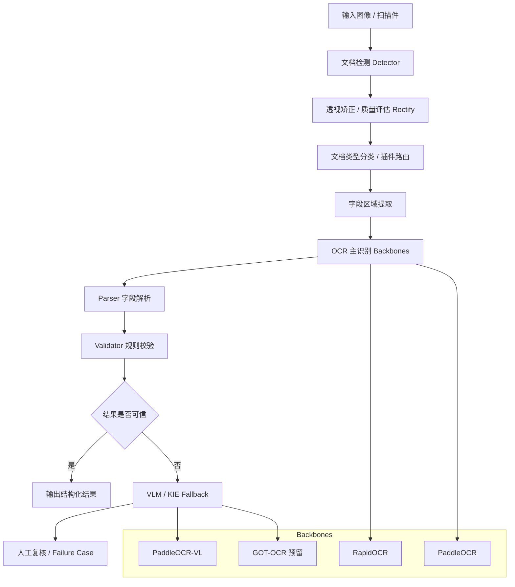

# id-doc-ocr 项目汇报稿

## 一、项目概述

id-doc-ocr 是一个面向证件、票据及结构化文档场景的自托管 OCR 识别项目。
它的目标不是做一个通用 OCR Demo，而是围绕“字段级结构化抽取”构建一条更接近生产系统的识别链路，包括文档检测、图像矫正、OCR 识别、规则校验、VLM 兜底以及人工复核预留能力。

从项目当前设计来看，它更强调：

- 结构化字段准确率，而不是整页文本识别效果
- 可解释、可审计、可回归
- 模块化、插件化、便于后续扩展
- 支持本地和容器化部署，具备服务化能力

整体定位比较清晰，属于“面向生产方向的 OCR 平台底座原型”。

---

## 二、项目目标与设计理念

从 README 和架构文档可以看到，这个项目有几个非常明确的设计原则。

### 1. 确定性优先，生成式补充
项目强调 **Deterministic first, generative second**。
也就是说，优先通过模板、字段区域、规则解析等确定性手段完成识别，再在弱模板、复杂版式或字段缺失时，使用 VLM / KIE 模型做补充。

这个方向对证件识别场景是合理的，因为证件类任务最终追求的是姓名、证件号、出生日期、有效期、MRZ 等关键字段的精确提取，而不是泛化的自由文本理解。

### 2. 字段准确率优先于整页 OCR 可读性
项目重点优化的是字段 exact match，而不是让整页 OCR 看起来“差不多正确”。
这意味着它更适合金融、政务、身份核验等业务场景。

### 3. 校验是核心环节，不是附属功能
项目明确把 validator 作为一等模块。
例如：
- 身份证号码合法性
- 日期格式与合理性
- MRZ 校验
- 跨字段一致性检查

这点很关键，因为业务上“识别出来”和“可用”是两回事。

### 4. 人工复核被纳入整体系统设计
项目架构中已经预留 review 环节，说明设计者并不假设模型可以 100% 自动化处理全部场景，而是认可低置信度情况下需要人工接管。这更接近真实生产系统思路。

---

## 三、系统架构图

---

## 四、当前项目已具备的核心能力

从代码和目录结构看，项目目前已经不只是一个想法或 Demo，而是具备了较完整的平台骨架。

### 1. 插件化文档识别体系
当前已支持多个插件类型，包括：

- `china_id`
- `passport`
- `boarding_pass`
- `hukou_booklet`
- `train_ticket`
- `medical_record`

每类文档插件都可以独立维护自己的：
- parser
- validator
- config
- label spec
- 训练 recipe

这种设计的好处是，未来新增文档类型时，不需要把所有逻辑都塞进一套巨大的主流程里，而是可以按插件扩展。

### 2. 端到端识别流水线
项目已经实现了一条 Demo 级但结构完整的识别链路，大体包括：

- 文档检测
- 几何矫正 / 质量评估
- OCR 主识别
- parser 字段抽取
- validator 规则校验
- VLM fallback
- 输出结构化结果

虽然部分底座模块还偏 mock 或骨架态，但主流程和模块边界已经建立起来了。

### 3. 多后端 OCR / VLM 适配
当前项目支持多个后端适配器：

OCR：
- mock
- rapidocr
- paddleocr
- got_ocr（目前更偏预留）

VLM：
- mock
- paddleocr_vl

这说明项目不是绑定某一个固定模型，而是希望形成一个可替换、可比较、可升级的识别底座。

### 4. API 服务与 CLI 工具
项目已经提供：
- `GET /health`
- `GET /capabilities`
- `POST /infer`

同时也提供 CLI 能力，用于：
- 列出插件
- 校验插件
- 数据集摘要
- manifest 构建 / 切分
- 启动服务

这使得项目具备了本地调试、接口接入和容器部署的基础能力。

### 5. 容器化与部署脚手架
仓库已经包含：
- Dockerfile
- docker-compose.yml
- Makefile
- .env.example

这说明项目已经考虑了“如何持续运行”和“如何被别人接入”，而不是只停留在本地脚本层面。

### 6. 回归测试与评估报告
这是这个项目比较有价值的一点。

当前仓库已经包含：
- fixture-based parser regression
- asset smoke regression
- JSON 报告输出
- 多个测试文件与服务 API 测试

根据仓库内当前报告：
- 11/11 fixtures passed
- 89/89 expected fields matched
- field exact-match rate = 1.0

这说明项目已经开始重视“质量闭环”，而不只是展示识别成功案例。

---

## 五、项目技术栈

项目当前技术栈偏务实、偏工程验证：

### 基础框架
- Python 3.10+
- FastAPI
- Uvicorn
- Pydantic 2

### OCR / 多模态方向
- PaddleOCR
- PaddleOCR-VL
- RapidOCR
- GOT-OCR 接口预留

### 工程化能力
- pytest
- httpx
- Docker / Docker Compose
- Makefile
- setuptools / pyproject 打包

整体看，选型目标不是“前沿炫技”，而是快速构建一个可跑、可测、可扩展的平台底座。

---

## 六、项目架构与工程亮点

### 1. 业务导向明确
这个项目不是泛 OCR，而是面向证件 / 结构化文档场景。
这使得很多设计决策都更聚焦，例如：
- 字段优先
- 校验优先
- 插件优先
- 人审预留

### 2. 模块边界比较清晰
项目按照 backbones、plugins、pipeline、validator、service、tools、eval 等模块拆分，后续不管是替换模型、增加文档类型，还是引入新的部署方式，理论上都比较顺。

### 3. 插件化设计适合长期演进
对文档识别类系统来说，最怕的是“所有逻辑写死在一起”。
这个项目目前的 plugin 体系，为后续扩文档种类提供了比较好的基础。

### 4. 回归体系比普通 Demo 完整
很多 OCR 项目停留在“给一张图跑一下”，但这个项目已经有：
- 样本集合
- fixture
- regression report
- failure logging

这意味着后续迭代时更容易知道是“优化了”还是“退化了”。

### 5. 服务化能力已经具备
API、CLI、Docker、Compose 这些能力已经接上，说明项目已经从“单人实验代码”往“团队可使用服务”方向迈了一步。

---

## 七、当前成熟度判断

我对当前项目状态的判断是：

## 这是一个“架构和解析层已经比较完整，但底层识别能力仍偏 Demo/骨架态”的项目。

换句话说，它已经不是一个纯概念验证，但也还不是完全可以直接大规模上线的生产系统。

### 相对成熟的部分
- 项目定位清晰
- 插件化架构合理
- parser / validator 逻辑较完整
- API / CLI / Docker 已经打通
- 回归测试机制较完整
- 文档比较齐

### 还不够成熟的部分
- detector / rectify 目前还偏 mock
- GOT-OCR 还是 placeholder
- VLM 路径更多像增强能力，不是完全稳定主链路
- regression 结果更偏 fixture / public sample，不完全等于真实线上表现
- 生产化运维能力还需补足，例如：
  - 更完善的日志和监控
  - 告警与审计
  - 人工复核工作流
  - 更系统的数据治理和版本管理

因此，更准确的说法是：

**它已经具备了成为“证件识别平台底座”的条件，但距离真正成熟的生产系统还差最后几步关键工程化。**

---

## 八、项目当前风险与短板

### 1. 真实复杂场景能力尚未完全验证
当前测试和样本更偏受控数据、公共样本和 fixture。
在真实业务里，常见问题包括：
- 模糊
- 反光
- 阴影
- 畸变
- 遮挡
- 多代模板差异
- 多语言混排

这些场景下的稳定性仍需要更多真实数据验证。

### 2. 回归结果偏理想化
当前 11/11 fixtures 通过、89/89 字段匹配，说明 parser/validator 层对已建模样本表现很好。
但它更多反映“已知规则场景下的稳定性”，不等于真实线上场景整体精度已经足够高。

### 3. 插件扩展会带来持续维护成本
每增加一种文档类型，都需要补齐：
- parser
- validator
- config
- 样本
- 回归用例
- 文档说明

插件化是优点，但也意味着未来会进入“规模化维护”阶段。

### 4. 多模型路径后续会引入复杂度
不同后端：
- 安装环境
- 依赖大小
- 推理性能
- 可复现性
- 服务资源消耗

都会影响生产落地。
特别是 PaddleOCR-VL 这类多模态能力，在实验价值很高，但落地时要考虑稳定性和成本。

### 5. 人工复核还停留在架构层
虽然 review 思路已经有了，但距离真正业务可用的人工复核后台还差不少产品化工作。

---

## 九、下一步建议

如果要把这个项目继续推进，建议重点投入在以下几个方向。

### 1. 从“架构完成”转向“真实识别能力补强”
优先补 detector / rectify 这些底层关键模块，尤其是针对拍照场景的：
- 定位
- 透视矫正
- 质量评估

因为证件识别系统中，前处理质量往往直接决定后续字段抽取上限。

### 2. 建立更真实的数据集与评估体系
建议逐步扩展：
- 真实拍照样本
- 多模板版本
- 异常样本
- 模糊/反光/遮挡样本

同时继续保持字段级评估，而不是退回到只看文本级指标。

### 3. 完善 failure case 闭环
建议把当前 failure_dir、回归报告、错误样本收集进一步产品化，形成：
- 失败样本自动沉淀
- 错误类型归类
- 回归集反哺
- 模型/规则优化闭环

### 4. 补齐生产化能力
包括：
- 日志与监控
- 指标统计
- 告警
- 审计
- 部署规范
- 模型版本管理

### 5. 推进人工复核工作流
把 review 从架构概念变成可实际操作的流程，是项目走向业务落地的重要一步。

---

## 十、结论

总体来看，id-doc-ocr 是一个方向正确、工程意识较强的项目。
它的价值不在于“已经把所有 OCR 问题都解决了”，而在于它已经把一个面向证件识别的平台底座搭出来了：

- 有插件化结构
- 有识别主流程
- 有规则校验
- 有 API 服务
- 有容器化部署
- 有回归体系

这意味着它已经从“模型实验”阶段，进入了“平台原型”阶段。

如果后续继续投入，重点不应只是继续堆模型，而是要把：
- 前处理能力
- 真实样本评估
- 人工复核闭环
- 生产化运维能力

这几项关键能力补齐。
一旦这些部分完善，这个项目是有机会演进成真正可落地的证件识别平台的。

---

## 十一、附：8页 PPT 提纲

1. 项目定位：id-doc-ocr 是什么
2. 项目目标：为什么不是通用 OCR Demo
3. 系统架构：识别主流程与模块分层
4. 核心能力：插件、服务、CLI、回归
5. 技术栈与工程化能力
6. 当前成熟度判断
7. 风险与短板
8. 下一步建议与结论
