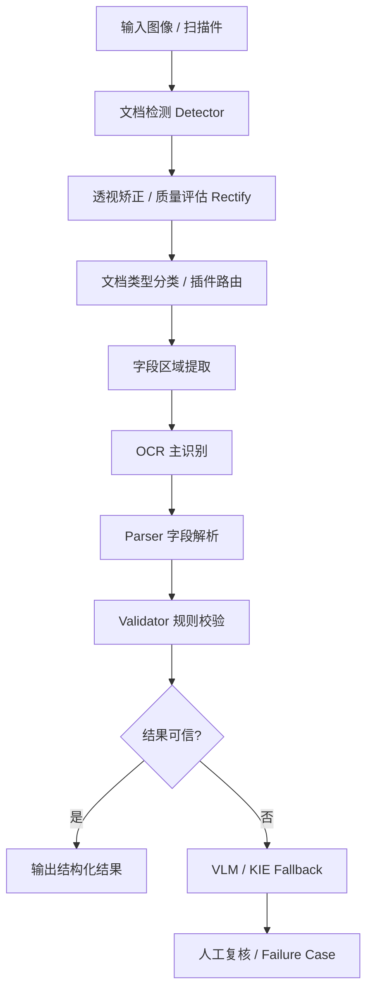

# id-doc-ocr 项目汇报
## 面向证件/结构化文档的 OCR 平台原型

- 汇报对象：项目/技术评审
- 重点：现状、价值、风险、下一步

---

# 1. 项目定位

**一句话定位**

id-doc-ocr 是一个面向证件、票据和结构化文档场景的自托管 OCR 平台原型。

**它不是**
- 通用 OCR Demo
- 单模型试验代码
- 只关注整页文本识别效果的工具

**它更像**
- 面向业务字段抽取的识别系统
- 可校验、可审计的识别流水线
- 可扩展、可部署的技术底座

---

# 2. 项目目标

## 核心目标

- 提高字段级准确率，而不是只追求整页可读性
- 适配证件/票据等结构化文档场景
- 支持可解释、可回归、可持续优化的识别流程
- 支持本地和容器化部署

## 设计原则

- **确定性优先，生成式补充**
- **字段优先于全文**
- **校验是核心能力**
- **人工复核是系统的一部分**

---

# 3. 系统架构

## 架构特点
- 多阶段流水线，而不是单模型一步到位
- 前处理、识别、解析、校验、复核职责清晰
- 模块可替换，便于后续升级模型与扩文档类型

---

# 4. 当前已具备的能力

## 插件化文档支持
- china_id
- passport
- boarding_pass
- hukou_booklet
- train_ticket
- medical_record

## 已有能力
- OCR / VLM 多后端适配
- API：`/health` ` /capabilities` ` /infer`
- CLI 工具链
- Docker / Compose / Makefile
- 回归测试与 JSON 报告

---

# 5. 技术栈与工程化

## 技术栈
- Python 3.10+
- FastAPI
- Uvicorn
- Pydantic 2
- pytest
- Docker / Docker Compose

## OCR / 多模态方向
- PaddleOCR
- PaddleOCR-VL
- RapidOCR
- GOT-OCR（接口预留）

## 工程化亮点
- API / CLI / Docker 已打通
- 模块边界清晰
- 回归测试机制较完整

---

# 6. 项目亮点

## 为什么这个项目值得继续投入

- **业务导向明确**：面向证件/结构化文档，而不是泛 OCR
- **技术路线靠谱**：确定性优先，模型兜底
- **插件化扩展性强**：文档类型可持续增加
- **工程意识较强**：服务化、部署、测试、回归已具雏形
- **质量闭环基础较好**：样本、fixture、报告都已具备

---

# 7. 当前成熟度判断

## 当前阶段

**架构和解析层已经比较完整，但底层识别能力仍偏 Demo / 骨架态。**

## 比较成熟的部分
- 项目定位清晰
- 插件化结构完整
- parser / validator 逻辑较扎实
- API / CLI / Docker 已打通
- 文档与回归机制较完整

## 尚未完全成熟的部分
- detector / rectify 仍偏 mock
- GOT-OCR 仍是 placeholder
- regression 更偏 fixture / public sample
- 生产化监控、告警、审计、复核后台仍需补齐

---

# 8. 风险与短板

## 主要风险
- 真实复杂场景能力仍需验证
  - 模糊 / 反光 / 遮挡 / 畸变 / 多模板差异
- 当前测试结果偏理想化
- 插件扩展会带来持续维护成本
- 多模型路线会引入环境与性能复杂度
- 人工复核闭环还未真正产品化

---

# 9. 下一步建议

## 建议优先级

1. **补强 detector / rectify**
2. **扩充真实数据与评估集**
3. **完善 failure case 闭环**
4. **补齐生产化能力**
   - 日志 / 监控 / 指标 / 审计 / 部署规范
5. **推进人工复核流程产品化**

---

# 10. 结论

## 总结

id-doc-ocr 已经完成了：
- 生产导向的 OCR 平台骨架
- 多文档插件解析能力
- 基础服务化与部署能力
- 回归测试与质量闭环基础

## 一句话结论

**它已经具备成为“证件识别平台底座”的条件；下一阶段重点应从“架构完整”转向“真实可落地”。**
