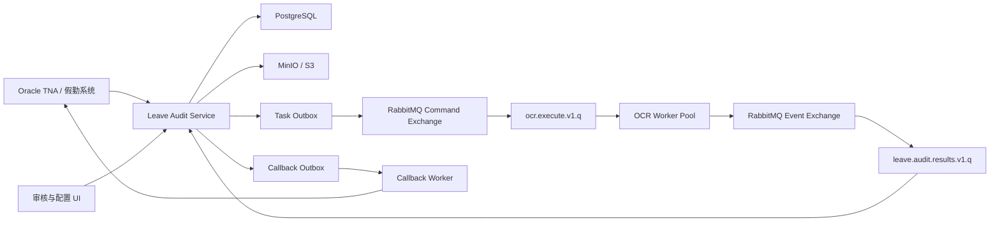

# Leave Audit Service 与 RabbitMQ 异步化演进设计

## 1. 文档状态

- 状态：Proposed
- 日期：2026-08-11
- 适用基线：`main` 的试点能力与 `dev` 的 Oracle TNA、多附件、PDF、动态规则及 Prompt 配置能力
- 目标：将假勤审核域拆分为独立 Service，通过 RabbitMQ 发送 OCR 任务并回传处理结果，在不中断现有试点链路的前提下逐步完成异步化、持久化和生产加固

## 2. 背景与问题

当前系统是插件化 OCR 平台与假勤旁路审核域组成的模块化单体。现有边界已经覆盖文档识别、规则核验、人工复核和外部假勤系统适配，但 API、OCR 推理、业务状态及回调仍处于同一运行时失败域。

`dev` 分支进一步增加了 Oracle TNA 接入、PDF 拆页、多附件处理、字段映射、审核规则和 Prompt 动态配置。这些能力使单次审核可能包含“多个附件 × 多个 PDF 页面 × OCR/VLM/Dify 调用”，继续同步执行将带来以下问题：

- OCR 长任务占用 API Worker，接口超时与模型故障互相影响。
- SQLite 无法可靠支持多个 API/Worker 实例共同认领任务。
- 业务事务提交与消息发送之间存在一致性窗口。
- RabbitMQ 的至少一次投递会产生重复消息，需要业务幂等。
- 多附件结果缺少显式聚合策略，可能产生错误的最终 PASS。
- 动态规则和 Prompt 缺少版本、审批、审计及历史复现能力。
- Oracle、对象存储、RabbitMQ、OCR 和回调系统会形成多个独立失败域。

## 3. 目标与非目标

### 3.1 目标

- 将 `leave_audit` 拆分为独立 Leave Audit Service。
- 将 OCR Pipeline 部署为可独立扩缩容的 Worker Pool。
- 使用 RabbitMQ 传递 OCR 命令和处理结果。
- 使用 PostgreSQL 保存业务状态、配置版本、Outbox 和消费幂等记录。
- 使用 MinIO/S3 类对象存储传递图片、PDF及必要中间产物。
- 实现至少一次投递、幂等消费、有限重试、死信处置和端到端追踪。
- 保留同步链路作为灰度期逃生通道，完成验证后再退役。
- 保留人工审批最终权限，任何技术失败均不得默认 PASS。

### 3.2 非目标

- 当前阶段不拆成多个细粒度业务微服务。
- 当前阶段不引入 Kafka、事件溯源或完整 CQRS。
- 不通过 RabbitMQ 传输图片、PDF、Oracle BLOB 或完整 PII 数据。
- 不在第一阶段拆分代码仓库；继续采用 monorepo 与多个部署入口。
- 不承诺跨区域双活，优先满足单区域高可用与可恢复性。

## 4. 目标架构



### 4.1 服务职责

| 组件 | 负责 | 不负责 |
| --- | --- | --- |
| Leave Audit Service | 任务同步、附件摄取、对象存储、任务状态、配置版本、结果聚合、业务规则、人工复核、回调编排 | OCR 模型执行 |
| OCR Worker | PDF 拆页、图像预处理、OCR/VLM、文档插件解析、页级与文档级识别结果 | 假勤业务规则、最终 PASS/REJECT、外部回调 |
| RabbitMQ | 任务与结果可靠传递、显式确认、有限重试、死信隔离 | 保存最终业务事实 |
| PostgreSQL | 审核任务、附件元数据、OCR 作业、配置版本、审计记录、Outbox、幂等记录 | 保存大附件原文 |
| MinIO/S3 | 原图、PDF及必要中间产物 | 保存业务状态 |
| Callback Worker | 对外回写、重试、补偿和回调审计 | 修改识别结果 |

### 4.2 所有权原则

- Leave Audit Service 是审核任务和最终业务决定的唯一所有者。
- OCR Worker 是计算执行者，不直接写入 Leave Audit 数据库。
- RabbitMQ 是传输设施，不作为业务状态查询来源。
- 对象存储中的附件通过不可猜测的 Object Key 或短期签名 URL 访问。
- Oracle Adapter 只存在于 Leave Audit Service 的接入边界，避免 Worker 数量直接放大 Oracle 连接数。

## 5. RabbitMQ 设计

### 5.1 消息模式

采用“命令 + 结果事件”，不采用 RabbitMQ RPC：

```text
Leave Audit Service
    -- ocr.execute.v1 -->
OCR Worker
    -- ocr.completed.v1 / ocr.failed.v1 -->
Leave Audit Service
```

### 5.2 拓扑

| 类型 | 名称 | Routing Key / 用途 |
| --- | --- | --- |
| Direct Exchange | `leave.audit.commands` | OCR 命令入口 |
| Quorum Queue | `ocr.execute.v1.q` | `ocr.execute.v1` |
| Topic Exchange | `leave.audit.events` | OCR 结果事件入口 |
| Quorum Queue | `leave.audit.results.v1.q` | `ocr.completed.v1`、`ocr.failed.v1` |
| Direct Exchange | `leave.audit.retry` | 有限次数延迟重试 |
| Queue | `ocr.execute.retry.30s.q` | 第一级短暂故障重试 |
| Queue | `ocr.execute.retry.5m.q` | 第二级外部依赖重试 |
| Direct Exchange | `leave.audit.dlx` | 最终失败消息 |
| Quorum Queue | `ocr.execute.dlq` | 人工分析与授权重放 |

生产环境要求：

- Exchange、Queue 和消息均持久化。
- 使用 publisher confirm，不以客户端 send 成功作为发布成功。
- Consumer 使用 manual ACK。
- 首期 `prefetch_count=1`，经过基准测试后再按模型内存和 CPU/GPU 容量调整。
- 重试次数写入消息 Header，并设置全链路最大尝试次数。
- DLQ 消息必须保留原始 `message_id`、`job_id`、`request_id` 和失败分类。

### 5.3 OCR 命令契约

```json
{
  "schema_version": "1.0",
  "message_id": "uuid",
  "job_id": "uuid",
  "request_id": "LV-xxx",
  "attachment_id": "ATT-xxx",
  "object_key": "leave-audit/2026/08/...",
  "content_sha256": "...",
  "plugin_name": "diagnosis_proof",
  "pipeline_profile": "production-v1",
  "config_snapshot_id": "cfg-xxx",
  "attempt": 1,
  "trace_id": "...",
  "created_at": "2026-08-11T00:00:00Z"
}
```

消息中不得包含图片、PDF、Oracle BLOB、完整 Prompt、员工姓名或其他非必要 PII。

### 5.4 结果契约

结果至少包含：

- `schema_version`
- `message_id`
- `causation_id`，对应命令消息 ID
- `job_id`、`request_id`、`attachment_id`
- `worker_version`、`model_versions`、`pipeline_profile`
- `config_snapshot_id`
- `content_sha256`
- `status`
- 标准化 `analysis`
- `started_at`、`completed_at`、`elapsed_ms`
- 可重试错误分类或永久错误分类
- `trace_id`

识别结果只表达文档分析事实，不直接给出假勤业务最终 PASS/REJECT。最终决定由 Leave Audit Service 使用版本化规则生成。

## 6. 一致性与幂等

RabbitMQ 提供至少一次投递，系统通过幂等实现“效果上的一次”。

### 6.1 任务发布

Leave Audit Service 在同一个 PostgreSQL 事务中：

1. 创建业务任务和 OCR Job。
2. 写入 `outbox_event`。
3. 提交事务。

Outbox Publisher 扫描未发布记录，发布到 RabbitMQ，收到 publisher confirm 后记录 `published_at`。即使 Publisher 在数据库提交后崩溃，消息仍会被后续实例补发。

### 6.2 Worker ACK 顺序

OCR Worker：

1. 消费并校验命令。
2. 获取附件并校验 SHA-256。
3. 执行推理。
4. 发布结果并等待 publisher confirm。
5. ACK 原任务。

如果结果发布成功后 Worker 在 ACK 前崩溃，命令会重复投递，因此结果消费者必须去重。

### 6.3 结果消费

Leave Audit Service 使用 `message_id` 去重，并对 `(job_id, result_version)` 建立唯一约束。在同一事务内保存结果、更新 Job、重新计算附件聚合和写入 Callback Outbox。

### 6.4 回调

回调幂等键使用 `request_id + decision_version`。外部系统不可用时只影响回调状态，不能回滚已经完成的 OCR、规则核验或人工复核结果。

## 7. 状态模型

技术执行状态与业务审核状态分离：

```text
OCR Job：
CREATED → QUEUED → PROCESSING → SUCCEEDED
                            └→ RETRYING → FAILED → DEAD

Audit Task：
PENDING → ANALYZING → ANALYZED → PASS / REVIEW / REJECT
                                  └→ CALLBACK_PENDING → SYNCED
```

技术失败不得自动映射为 PASS。超过重试上限的任务进入 `FAILED/DEAD`，业务侧进入人工处理或明确错误状态。

## 8. 多附件与多页聚合

多页结果先聚合为附件级结果，多附件再聚合为任务级业务决定。禁止通过固定状态排序隐式选择“最佳附件”。

支持的附件聚合策略：

- `ALL_REQUIRED`：所有必要附件均合格才可 PASS。
- `ANY_SUFFICIENT`：任一满足条件的附件即可 PASS。
- `WORST_CASE`：采用风险最高的附件状态。
- `DOCUMENT_SET_RULES`：根据附件组合执行专门业务规则。

默认采用保守策略。只有业务配置显式声明 `ANY_SUFFICIENT` 时，一个 PASS 才能覆盖其他非必要附件的失败。每次决定必须保存 `aggregation_policy`、参与附件、规则版本和解释证据。

## 9. 配置治理

字段映射、审核规则和 Prompt 都属于可改变审核结果的决策资产，必须版本化：

```text
DRAFT → VALIDATED → APPROVED → ACTIVE → RETIRED
```

要求：

- 配置修改 API 启用认证和 RBAC。
- 保存修改人、修改原因、审批人和发布时间。
- 新配置生效前运行固定回归集。
- 每个 OCR Job 保存不可变 `config_snapshot_id`。
- 历史任务始终能还原当时的规则、字段映射和 Prompt。
- 支持回滚到上一个已发布版本。
- 限制 CORS 来源，不允许生产环境使用通配符。

## 10. 里程碑演进路线

### M0：冻结边界和基线

预计：3～5 个工作日。

工作内容：

- 记录当前吞吐、OCR 延迟、成功率、REVIEW 率和失败类型。
- 评审 Leave Audit Service 与 OCR Worker 职责。
- 冻结任务及结果消息 Schema v1。
- 冻结技术状态与业务状态转换表。
- 业务确认多附件聚合语义。
- 建立 `request_id → job_id → attachment_id → message_id` 追踪关系。
- 建立本设计第 15 节所列 ADR。

完成标准：

- Schema 与状态机完成评审。
- 当前回归与性能基线可重复执行。
- 不存在未定义的多附件结果组合。

回滚：没有运行时变更。

### M1：整理代码边界，保持同步运行

预计：1～2 周。

工作内容：

- 将 `AuditService` 拆成附件摄取、任务分发、结果处理、附件聚合、业务决定和回调组件。
- OCR 层移除假别、员工、审批和回调概念。
- Oracle Adapter 只保留在 Leave Audit 接入侧。
- 建立对象存储与消息 Transport 抽象。
- 修正隐式多附件状态选择逻辑。
- 为字段映射、规则及 Prompt 增加版本和快照对象。
- 设置附件大小、附件数量、PDF 页数、单页像素及总处理预算。

完成标准：

- 当前同步链路行为保持兼容。
- 跨边界调用均通过显式接口。
- 多附件状态组合具备完整测试。
- OCR 引擎可脱离假勤任务结构独立运行。

回滚：保留原同步 Facade。

### M2：PostgreSQL 与配置治理

预计：1～2 周。

工作内容：

- 抽象 Repository，引入 PostgreSQL 实现和 Alembic。
- 本地测试继续支持 SQLite，生产禁止多实例使用 SQLite。
- 建立 `audit_task`、`audit_attachment`、`ocr_job`、`ocr_result`、`audit_decision`、`config_version`、`outbox_event`、`callback_outbox` 和 `consumed_message`。
- 实现配置草稿、校验、审批、发布和回滚。
- 为配置 API 增加认证、RBAC、审计和 CORS 白名单。
- 完成 SQLite 数据迁移及 PostgreSQL 备份恢复演练。

完成标准：

- 历史任务可以按配置快照复现。
- 未授权用户无法修改决策配置。
- PostgreSQL 恢复演练满足 RPO/RTO。

回滚：保留只用于单实例恢复的 SQLite Repository。

### M3：RabbitMQ 基础设施与 Outbox

预计：1 周。

工作内容：

- 部署 RabbitMQ，生产采用 3 节点 quorum queue。
- 配置 TLS、独立 vhost 和最小权限账号。
- 实现 Task Outbox Publisher、publisher confirm 和结果消费者骨架。
- 建立重试队列、DLQ、消息兼容测试和监控仪表盘。
- 以 feature flag 启用影子消息发布，现有同步 OCR 仍是事实来源。

完成标准：

- 数据库提交后 Publisher 崩溃仍能补发任务。
- 重复发布不会创建重复业务任务。
- RabbitMQ 重启不丢失已确认的持久消息。
- DLQ 中每条消息均可关联原始请求。

回滚：关闭 Outbox Publisher。

### M4：独立 OCR Worker 与影子流量

预计：1～2 周。

工作内容：

- 增加独立 OCR Worker 启动入口和容器。
- Worker 启动时加载并预热模型。
- 实现对象存储读取、哈希校验、PDF 资源限制、结果发布确认和 ACK 顺序。
- CPU/GPU Worker 使用独立 Routing Key 和队列。
- 同一附件同时运行旧同步链路与新异步链路，新结果只进入 Shadow 表。
- 对比字段、风险、耗时和业务建议。

完成标准：

- 新旧结果一致率达到约定阈值。
- 重复消息不产生重复业务影响。
- 强制终止 Worker 后任务能够恢复。
- 超大 PDF、损坏文件和模型异常能进入正确的重试或 DLQ。

回滚：停止影子发布，不影响旧链路。

### M5：异步结果闭环与灰度切流

预计：1～2 周。

切流顺序：

```text
内部测试账号 → 5% → 25% → 50% → 100%
```

工作内容：

- 运行接口改为返回 `202 Accepted` 与 `request_id/job_id`。
- UI 使用轮询或 SSE 展示异步状态。
- 结果消费者完成去重、落库、规则执行、多附件聚合和 Callback Outbox 创建。
- 保留 `sync|shadow|async` 执行模式开关。
- 每个灰度阶段对比成功率、P95、REVIEW 率、严重假 PASS、积压及 DLQ。

切流闸门：

- 任务丢失为 0。
- 重复投递不产生重复回调或状态副作用。
- 技术成功率不低于 95%。
- REVIEW 率与严重假 PASS 没有异常变化。
- DLQ 能在 SOP 约定时间内处置。

回滚：新任务切回同步模式，已入队任务安全排空或继续处理。

### M6：Callback 解耦

预计：1 周。

工作内容：

- 在结果消费事务中写入 Callback Outbox。
- Callback Worker 独立执行 Oracle、HTTP 或 MQ 回写适配器。
- 使用 `request_id + decision_version` 作为回调幂等键。
- 区分暂时错误与永久错误，实施指数退避和最大重试次数。
- 人工修改决定时生成新的 `decision_version`，不覆盖历史。
- 如果外部假勤系统支持 MQ，发布版本化 `leave.audit.decision.v1`；否则继续使用受控 Adapter。

完成标准：

- 外部假勤系统停机不阻塞 OCR 和人工复核。
- 外部系统恢复后可自动补偿。
- 重复回调不会重复改变假勤单。
- 所有回调尝试均可通过 `request_id` 查询。

回滚：暂停 Callback Worker，Outbox 保留待回写记录。

### M7：生产加固与同步链路退役

预计：1～2 周。

工作内容：

- 演练 RabbitMQ 节点故障、PostgreSQL 主备切换和 Worker 宕机。
- 测试重复、乱序、毒消息、对象存储不可用和附件过期。
- 打通 OpenTelemetry Trace、结构化日志和核心指标。
- 建立按队列积压和最老消息年龄扩缩容的策略。
- 建立 DLQ 授权重放工具和操作 SOP。
- 落实传输/静态加密、PII 脱敏及数据保留周期。
- 异步链路连续稳定运行两个观察周期后，提交同步链路退役审批。

同步链路退役条件：

- 没有无法解释的任务丢失。
- 重试和 DLQ SOP 已演练。
- 假 PASS、REVIEW 率及接口成功率符合试点标准。
- 业务 Owner 批准取消同步兜底。

## 11. 分支与发布策略

- 以 `dev` 的 Oracle、多附件、PDF 和动态配置能力作为下一阶段能力参考。
- 不继续在旧 `opt/*` 分支上演进；其有效能力已被后续提交覆盖。
- 架构改造按里程碑使用短生命周期分支与独立 PR。
- 每个里程碑必须包含 feature flag、数据迁移说明、回滚说明和可观测性。
- 不在一个 PR 中同时完成 PostgreSQL、RabbitMQ、Worker 拆分和全量切流。

## 12. 非功能需求与验收指标

以下为初始目标，M0 应根据真实流量基线确认：

| 指标 | 初始目标 |
| --- | --- |
| API 入队响应 | P95 < 300 ms |
| 任务丢失 | 0 |
| 重复业务影响 | 0 |
| OCR 技术成功率 | ≥ 95% |
| RabbitMQ 最老消息年龄 | 正常流量下 < 2 分钟 |
| DLQ 可追踪率 | 100% |
| 端到端 request/job 追踪覆盖 | 100% |
| Callback 最终成功率 | ≥ 99.5%，否则进入人工处置 |
| RPO | ≤ 5 分钟 |
| RTO | ≤ 1 小时 |
| 严重假 PASS | 0 容忍并触发回滚 |

## 13. 可观测性

必须采集：

- API 入队延迟和错误率。
- Outbox 未发布数量和最老记录年龄。
- RabbitMQ ready、unacked、publish、deliver、ack、redelivery 和 DLQ 数量。
- 每个 OCR 阶段耗时、模型版本、Worker 资源占用和冷启动次数。
- 任务总耗时及各阶段等待时间。
- 结果重复率、消息版本不兼容次数和幂等冲突次数。
- PASS/REVIEW/REJECT 分布及严重假 PASS 事件。
- Callback 尝试次数、最终成功率和积压年龄。

所有日志和 Trace 使用统一的 `request_id`、`job_id`、`attachment_id`、`message_id` 和 `trace_id`。

## 14. 主要失败模式

| 失败 | 影响 | 处理方式 |
| --- | --- | --- |
| RabbitMQ 不可用 | 新任务暂时无法发送 | Outbox 持久化并重试，API 返回已受理状态 |
| Worker 崩溃 | 未 ACK 任务重投 | 幂等处理，Worker 重启恢复 |
| 结果已发但原任务未 ACK | 命令重复执行 | 结果消费者按消息和 Job 版本去重 |
| 对象存储不可用 | Worker 无法读取附件 | 有限重试，超限进入 DLQ/人工处理 |
| Oracle 不可用 | 无法摄取新任务或附件 | 接入侧熔断，不影响已有 OCR Job |
| PostgreSQL 不可用 | 业务状态无法更新 | 停止消费并保留 RabbitMQ 消息 |
| 配置版本不存在 | 无法稳定复现处理 | 拒绝执行并进入配置错误队列 |
| 超大或恶意 PDF | 资源耗尽风险 | 大小、页数、像素、时间和内存预算限制 |
| 外部回调失败 | 假勤系统未收到结果 | Callback Outbox 补偿，不回滚审核结果 |
| 消息 Schema 不兼容 | Consumer 解析失败 | 版本路由、兼容测试和隔离队列 |

## 15. 架构决策记录摘要

后续应拆分为独立 ADR 文件：

1. ADR-001：Leave Audit Service 与 OCR Worker 采用异步服务边界。
2. ADR-002：RabbitMQ 采用命令与结果事件模式，不使用 RPC。
3. ADR-003：RabbitMQ 提供至少一次投递，业务实现幂等效果。
4. ADR-004：PostgreSQL 是业务状态和 Outbox 的唯一生产存储。
5. ADR-005：附件经对象存储传递，不进入 MQ 消息体。
6. ADR-006：使用 Transactional Outbox 解决数据库与消息发布一致性。
7. ADR-007：多附件聚合策略必须显式配置并默认保守。
8. ADR-008：规则、字段映射和 Prompt 必须版本化及可审计。
9. ADR-009：继续采用 monorepo 与多个部署入口，暂不拆仓库。

## 16. 推荐实施顺序

```text
M0 契约与基线
 ↓
M1 代码边界整理
 ↓
M2 PostgreSQL 与配置版本
 ↓
M3 RabbitMQ + Outbox
 ↓
M4 OCR Worker 影子运行
 ↓
M5 异步灰度切流
 ↓
M6 Callback 解耦
 ↓
M7 生产加固与同步链路退役
```

该顺序优先消除代码和数据边界的不确定性，再引入消息系统，最后切换业务流量。它避免一次性重构，同时确保每个里程碑都有独立验收标准和明确回滚路径。
